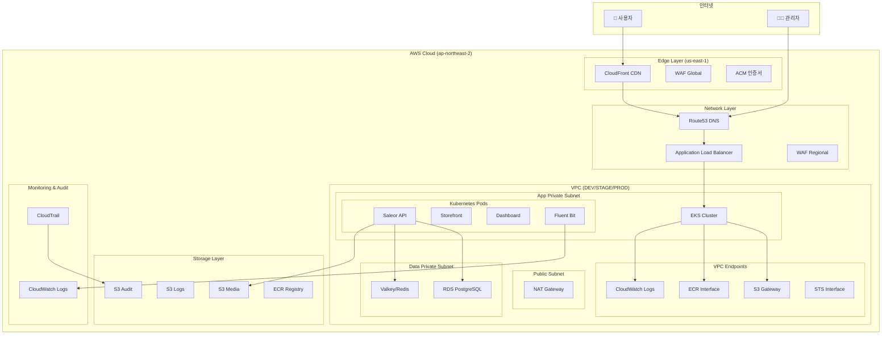
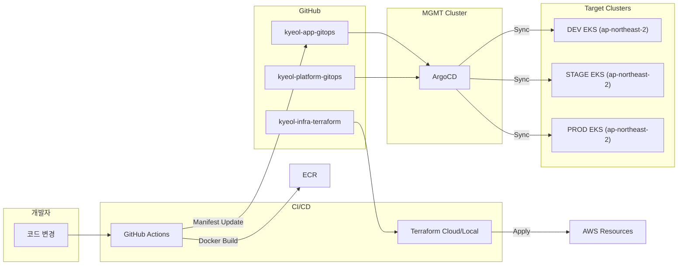
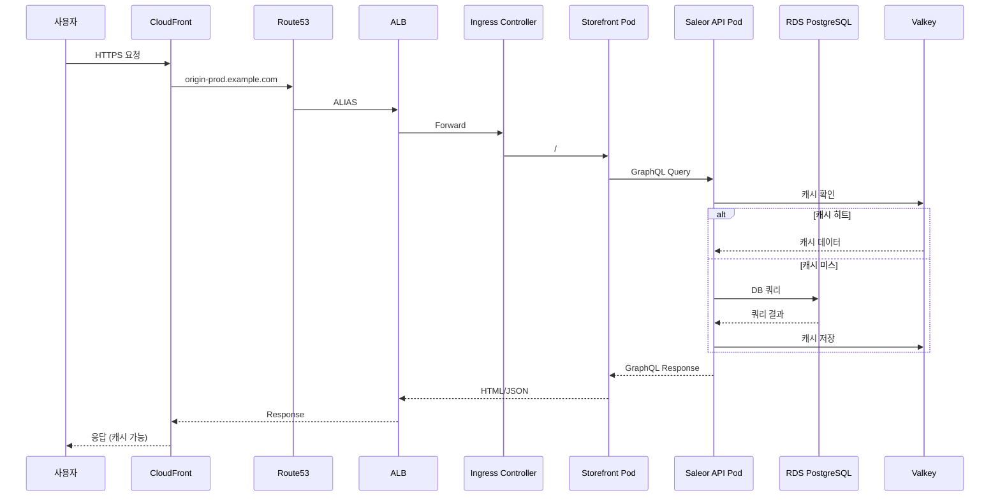
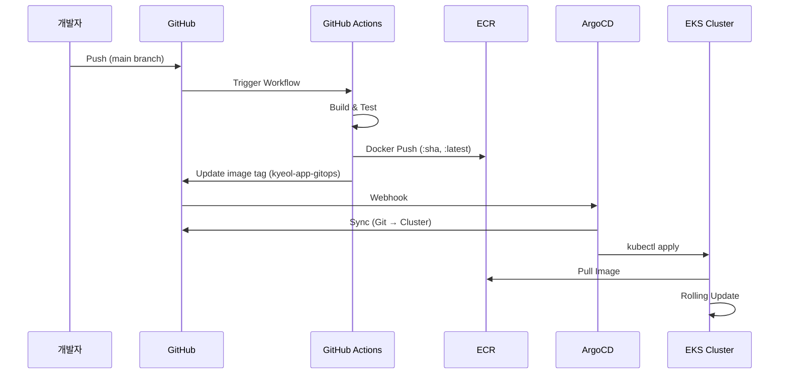

# KYEOL 프로젝트 아키텍처 & 서비스 정리

> **버전**: 1.0  
> **작성일**: 2026-01-05  
> **프로젝트**: KYEOL Saleor e-Commerce Platform

---

## 목차

1. [프로젝트 개요](#1-프로젝트-개요)
2. [아키텍처 다이어그램](#2-아키텍처-다이어그램)
3. [AWS 서비스 목록](#3-aws-서비스-목록)
4. [Kubernetes & GitOps](#4-kubernetes--gitops)
5. [애플리케이션 스택](#5-애플리케이션-스택)
6. [트래픽 흐름](#6-트래픽-흐름)
7. [CI/CD 파이프라인](#7-cicd-파이프라인)
8. [리포지토리 구조](#8-리포지토리-구조)

---

## 1. 프로젝트 개요

### 1.1. 목적

KYEOL은 **Saleor** 기반의 B2C e-Commerce 플랫폼으로, AWS EKS 위에서 운영되며 GitOps 방식으로 배포됩니다.

### 1.2. 환경 구성

| 환경 | 용도 | VPC CIDR | 리전 |
|:----:|------|----------|------|
| **MGMT** | ArgoCD, 관리 도구 | 10.0.0.0/16 | ap-northeast-2 |
| **DEV** | 개발/테스트 | 10.10.0.0/16 | ap-northeast-2 |
| **STAGE** | 스테이징/QA | 10.20.0.0/16 | ap-northeast-2 |
| **PROD** | 프로덕션 | 10.30.0.0/16 | ap-northeast-2 |

### 1.3. Phase별 구현 범위

| Phase | 범위 | 상태 |
|:-----:|------|:----:|
| **Phase 1** | VPC, EKS, RDS, ECR, 기본 인프라 | ✅ 완료 |
| **Phase 2** | STAGE/PROD 확장, Valkey, HA 구성 | ✅ 완료 |
| **Phase 3** | VPC Endpoints, S3, WAF, CloudFront, CloudTrail | 🔄 진행중 |

---

## 2. 아키텍처 다이어그램

### 2.1. 전체 시스템 아키텍처



### 2.2. GitOps 배포 흐름



---

## 3. AWS 서비스 목록

### 3.1. 컴퓨팅 & 컨테이너

| 서비스 | 용도 | 환경 | Terraform 관리 |
|--------|------|------|:--------------:|
| **EKS** | Kubernetes 클러스터 | 전체 | ✅ |
| **EC2** | EKS Worker Nodes | 전체 | ✅ (Node Group) |
| **ECR** | 컨테이너 이미지 레지스트리 | 전체 | ✅ |

### 3.2. 네트워킹

| 서비스 | 용도 | 환경 | Terraform 관리 |
|--------|------|------|:--------------:|
| **VPC** | 가상 네트워크 | 전체 | ✅ |
| **Subnet** | Public/Private 서브넷 | 전체 | ✅ |
| **NAT Gateway** | 프라이빗 아웃바운드 | 전체 | ✅ |
| **Internet Gateway** | 퍼블릭 인바운드 | 전체 | ✅ |
| **Route53** | DNS 관리 | 전체 | ✅ |
| **ALB** | L7 로드밸런서 | 전체 | ❌ (Ingress) |
| **VPC Endpoints** | 프라이빗 AWS 접근 | Phase 3 | ✅ |

### 3.3. 데이터베이스 & 캐시

| 서비스 | 용도 | 환경 | Terraform 관리 |
|--------|------|------|:--------------:|
| **RDS PostgreSQL** | 메인 데이터베이스 | 전체 | ✅ |
| **ElastiCache (Valkey)** | 세션/캐시 | STAGE/PROD | ✅ |
| **Secrets Manager** | DB 자격증명 | 전체 | ✅ |

### 3.4. 스토리지

| 서비스 | 용도 | 환경 | Terraform 관리 |
|--------|------|------|:--------------:|
| **S3 Media** | 미디어/이미지 저장 | Phase 3 | ✅ |
| **S3 Logs** | 서비스 로그 저장 | Phase 3 | ✅ |
| **S3 WAF Logs** | WAF 로그 저장 | Phase 3 | ✅ |
| **S3 Audit** | CloudTrail 로그 | Phase 3 | ✅ |

### 3.5. 보안

| 서비스 | 용도 | 환경 | Terraform 관리 |
|--------|------|------|:--------------:|
| **WAF (Regional)** | ALB 보호 | Phase 3 | ✅ |
| **ACM** | SSL/TLS 인증서 | 전체 | ✅ 참조 |
| **IAM** | 권한 관리 | 전체 | ✅ |
| **KMS** | 암호화 키 관리 | STAGE/PROD | ✅ |
| **Security Groups** | 네트워크 방화벽 | 전체 | ✅ |

### 3.6. CDN & Edge

| 서비스 | 용도 | 환경 | Terraform 관리 |
|--------|------|------|:--------------:|
| **CloudFront** | CDN | STAGE/PROD | ✅ |
| **ACM (us-east-1)** | CloudFront 인증서 | STAGE/PROD | ✅ 참조 |
| **ACM (ap-northeast-2)** | ALB 인증서 | 전체 | ✅ 참조 |

### 3.7. 모니터링 & 감사

| 서비스 | 용도 | 환경 | Terraform 관리 |
|--------|------|------|:--------------:|
| **CloudWatch Logs** | 로그 수집/저장 | 전체 | EKS 자동 |
| **CloudWatch Metrics** | 메트릭 수집 | 전체 | 자동 |
| **CloudTrail** | API 감사 로그 | PROD | ✅ (Phase 3) |

---

## 4. Kubernetes & GitOps

### 4.1. EKS 클러스터 구성

| 구성 요소 | 설명 |
|----------|------|
| **Control Plane** | AWS 관리형 |
| **Node Group** | Managed Node Group (t3.large/xlarge) |
| **OIDC Provider** | IRSA 지원 |
| **CNI** | AWS VPC CNI |
| **CSI** | EBS CSI Driver |

### 4.2. 클러스터 Add-ons

| Add-on | 관리 방식 | 용도 |
|--------|----------|------|
| **AWS Load Balancer Controller** | Helm (GitOps) | ALB/NLB 생성 |
| **ExternalDNS** | Helm (GitOps) | Route53 자동 관리 |
| **ArgoCD** | Helm (MGMT only) | GitOps 배포 |
| **Fluent Bit** | Helm (GitOps) | 로그 수집 |
| **Metrics Server** | Manifest | HPA 지원 |
| **Cert Manager** | Helm (GitOps) | 인증서 관리 |

### 4.3. IRSA (IAM Roles for Service Accounts)

| 서비스 어카운트 | IAM Role | 권한 |
|----------------|----------|------|
| `aws-load-balancer-controller` | `*-alb-controller-role` | ELB 관리 |
| `external-dns` | `*-external-dns-role` | Route53 관리 |
| `fluent-bit` | `*-fluent-bit-role` | CloudWatch Logs |

---

## 5. 애플리케이션 스택

### 5.1. Saleor 구성 요소

| 컴포넌트 | 기술 스택 | 설명 |
|----------|----------|------|
| **Saleor API** | Python/Django/GraphQL | 백엔드 API |
| **Storefront** | Next.js/React | 프론트엔드 (SSR) |
| **Dashboard** | React | 관리자 대시보드 |

### 5.2. 데이터 저장소

| 용도 | 서비스 | 설명 |
|------|--------|------|
| 메인 DB | RDS PostgreSQL | 상품/주문/사용자 데이터 |
| 세션/캐시 | Valkey (ElastiCache) | 세션, GraphQL 캐시 |
| 미디어 | S3 | 상품 이미지, 첨부파일 |

---

## 6. 트래픽 흐름

### 6.1. 사용자 요청 흐름



### 6.2. CI/CD 흐름



---

## 7. CI/CD 파이프라인

### 7.1. GitHub Actions 워크플로우

| 워크플로우 | 트리거 | 동작 |
|-----------|--------|------|
| `build-push.yaml` | Push to main | Docker Build → ECR Push |
| `update-manifest.yaml` | 빌드 완료 후 | GitOps manifest 업데이트 |
| `terraform-plan.yaml` | PR | Terraform Plan 실행 |

### 7.2. ArgoCD 애플리케이션

| App | Source Repo | Path | Target |
|-----|-------------|------|--------|
| saleor-api-dev | kyeol-app-gitops | overlays/dev | DEV EKS |
| saleor-api-stage | kyeol-app-gitops | overlays/stage | STAGE EKS |
| saleor-api-prod | kyeol-app-gitops | overlays/prod | PROD EKS |
| platform-addons | kyeol-platform-gitops | clusters/{env} | 각 EKS |

---

## 8. 리포지토리 구조

### 8.1. 리포지토리 목록

| # | 레포지토리 이름 | 로컬 폴더 | 역할 |
|:-:|----------------|----------|------|
| 1 | `kyeol-infra-terraform` | `kyeol-infra-terraform/` | Terraform IaC (VPC, EKS, RDS, ECR) |
| 2 | `kyeol-platform-gitops` | `kyeol-platform-gitops/` | ArgoCD, 클러스터 Addons |
| 3 | `kyeol-app-gitops` | `kyeol-app-gitops/` | Saleor App Manifesto |
| 4 | `kyeol-storefront` | `kyeol-storefront/` | Saleor Storefront 앱 (Fork) |
| 5 | `kyeol-saleor-dashboard` | `kyeol-saleor-dashboard/` | Saleor Dashboard 앱 (Fork) |

### 8.2. kyeol-infra-terraform 구조

```
kyeol-infra-terraform/
├── modules/
│   ├── vpc/           # VPC, Subnet, NAT, Endpoints
│   ├── eks/           # EKS Cluster, Node Group, IRSA
│   ├── rds_postgres/  # RDS PostgreSQL
│   ├── valkey/        # ElastiCache Valkey
│   ├── ecr/           # ECR Repository
│   ├── s3/            # S3 Buckets (Phase 3)
│   ├── waf/           # WAF Web ACL (Phase 3)
│   ├── cloudfront/    # CloudFront (Phase 3)
│   └── cloudtrail/    # CloudTrail (Phase 3)
├── envs/
│   ├── dev/           # DEV 환경
│   ├── stage/         # STAGE 환경
│   └── prod/          # PROD 환경
└── docs/
```

### 8.3. kyeol-app-gitops 구조 (Kustomize)

```
kyeol-app-gitops/
├── base/
│   ├── api/           # Saleor API Base
│   ├── storefront/    # Storefront Base
│   └── dashboard/     # Dashboard Base
└── overlays/
    ├── dev/           # DEV 오버레이
    ├── stage/         # STAGE 오버레이
    └── prod/          # PROD 오버레이
```

### 8.4. kyeol-platform-gitops 구조 (Helm)

```
kyeol-platform-gitops/
├── clusters/
│   ├── dev/values/
│   ├── stage/values/
│   └── prod/values/
└── common/
    └── values/
```

---

## 요약 다이어그램

```
┌─────────────────────────────────────────────────────────────────────────┐
│                           KYEOL Architecture                            │
├─────────────────────────────────────────────────────────────────────────┤
│                                                                         │
│   ┌──────────┐     ┌──────────┐     ┌──────────┐     ┌──────────┐     │
│   │ CloudFront│────▶│  Route53 │────▶│   ALB    │────▶│   EKS    │     │
│   │   (CDN)   │     │  (DNS)   │     │  (L7 LB) │     │ (K8s)    │     │
│   └──────────┘     └──────────┘     └──────────┘     └────┬─────┘     │
│         │                │                                  │           │
│         ▼                ▼                                  ▼           │
│   ┌──────────┐     ┌──────────┐                       ┌──────────┐     │
│   │   WAF    │     │   ACM    │                       │  Pods:   │     │
│   │(보안필터)│     │ (인증서) │                       │ API/SF/DB│     │
│   └──────────┘     └──────────┘                       └────┬─────┘     │
│                                                             │           │
│                    ┌────────────────────────────────────────┼───────┐   │
│                    │                VPC                     │       │   │
│                    │  ┌─────────┐  ┌─────────┐  ┌─────────┐ │       │   │
│                    │  │  RDS    │  │ Valkey  │  │   S3    │◀┘       │   │
│                    │  │(Postgres)  │ (Cache) │  │ (Media) │         │   │
│                    │  └─────────┘  └─────────┘  └─────────┘         │   │
│                    └────────────────────────────────────────────────┘   │
│                                                                         │
│   ┌────────────────────────────────────────────────────────────────┐   │
│   │                      DevOps / CI/CD                             │   │
│   │  GitHub Actions ──▶ ECR ──▶ ArgoCD ──▶ EKS (Rolling Update)    │   │
│   │  Terraform     ──▶ AWS Resources (VPC, EKS, RDS, S3, etc.)     │   │
│   └────────────────────────────────────────────────────────────────┘   │
│                                                                         │
└─────────────────────────────────────────────────────────────────────────┘
```

---

**문서 업데이트 기록**

| 날짜 | 버전 | 변경 내용 |
|------|------|----------|
| 2026-01-05 | 1.0 | 최초 작성 (Phase 3 포함) |
